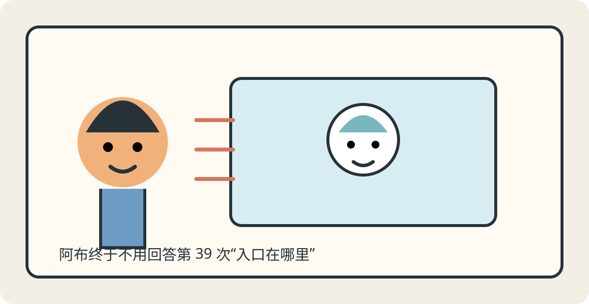
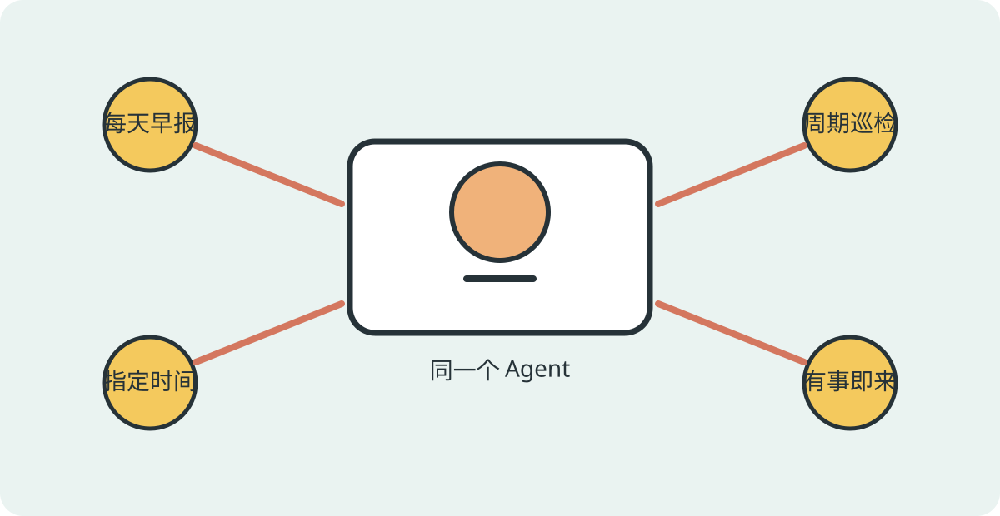
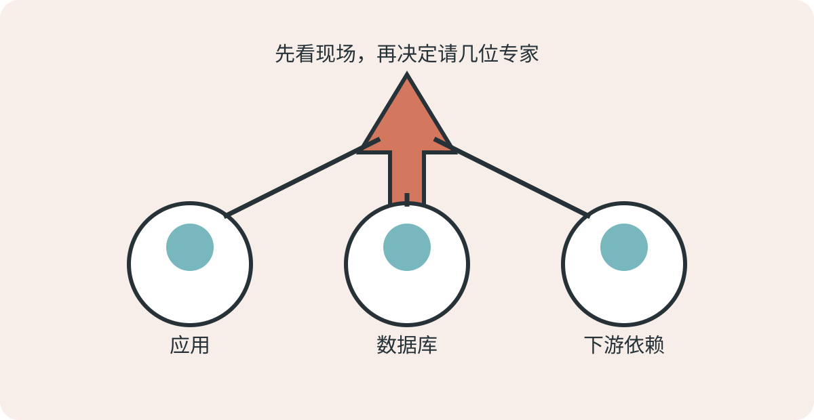
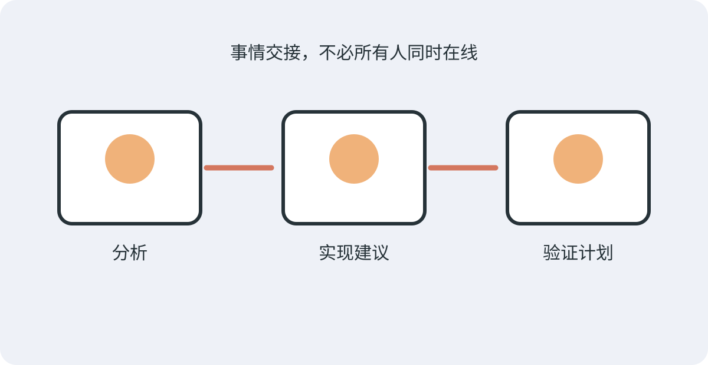
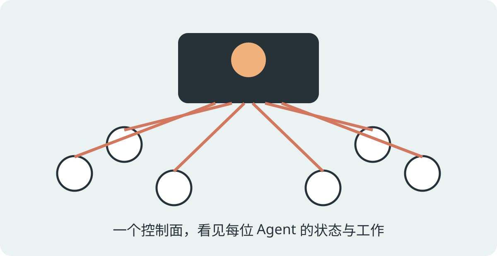
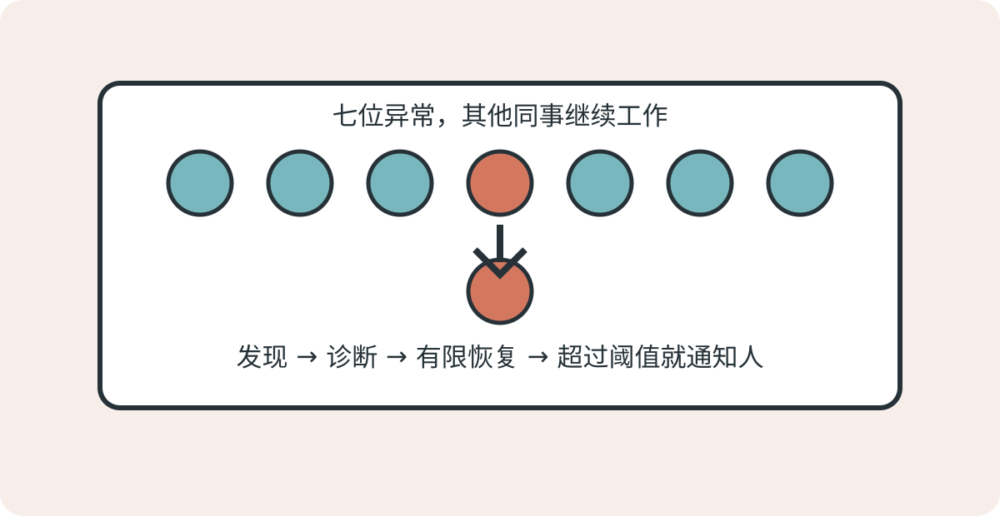

# 公司来了三百位 AI 同事以后，阿布终于开始做“人该做的事”

> 栏目：06 · Agent Compose 企业应用全景

阿布第一次认真考虑招聘一位 AI 同事，是在一个星期一的上午。

九点零三分，有人问：“报销入口在哪里？”

九点十一分，有人问：“新员工培训从哪儿进？”

十点二十七分，第三个人发来一句：“在吗？”等阿布回复“在”，对方才继续问：“报销入口在哪里？”

下午四点，阿布看了一眼聊天记录。他当天回答了三十八个问题，其中二十九个可以从公司手册里找到答案，六个应该去问别的部门，另外三个需要他真正动脑筋。

可他的时间，几乎全花在了前两类上。

产品经理小林听完，提议做个机器人。运维老周没有反对，只问了三个不太浪漫的问题：

“它能看哪些资料？谁来告诉它该怎么说话？半夜挂了算谁的？”

小林说：“我们才刚准备给它取名字。”

老周点点头：“那很好，至少名字挂了不影响业务。”

他们当时都没想到，这位尚未取名的机器人，后来会变成公司第一位 AI 员工；更没想到一年以后，公司要同时管理三百多位这样的同事。

## 第一位 AI 同事，没有想象中那么神通广大

阿布给它取名叫“小答”。名字朴素，工作也朴素：接住员工的问题，从允许使用的资料中寻找答案；没有依据时，就老老实实告诉对方应该找谁。

团队没有一开始就把财务、人事、客户系统的钥匙全交给它。小答能看公司公开制度，却看不到个人工资；能解释报销流程，却不能替员工审批；能推荐联系人，却不能假装已经替谁打过电话。

这些限制没有让它显得笨，反而让大家逐渐愿意相信它。

最初，员工从聊天页面找到小答。后来行政把它接进内部工作台，研发同学偶尔也从终端里询问。入口变了，小答的岗位说明和能力边界没有跟着复制三遍。

这背后是 Agent Compose 做的第一件事：把一个 Agent 当成可以被清楚定义和稳定运行的工作单元。它使用什么模型、在哪种环境里工作、能访问哪些资料和工具、该遵守什么规则，都由同一份声明管理；外面的聊天窗口和业务系统，只是不同的来访入口。

阿布很快发现，最理想的结果并不是“以后没人找我了”。恰恰相反，找他的人变少了，但问题变难了。

员工不再问“入口在哪里”，而是问：“这次出差跨了两个项目，费用到底应该归哪边？”

小答负责重复而明确的问题，阿布开始处理制度没有覆盖的例外。机器没有抢走他的工作，只是把他从工作里最像机器的那一部分解放了出来。

## 一场客户活动，让“会回答”突然不够用了

三个月后，公司准备发布一款新产品。

活动前一周，市场部把产品介绍、价格政策和常见问题交给小答。销售觉得这位新同事好用，提出为每个区域准备一位面向客户的接待 Agent。客服也申请了自己的版本，希望它能先整理问题，再转给人工。

小林很兴奋：“看起来我们已经有一支 AI 团队了。”

老周看着越来越长的需求表，说：“目前更像一群穿着相同制服、但不知道什么时候上班的人。”

于是他们给这支团队安排了工作节奏。

每天早上，市场 Agent 汇总前一天最常被问到的问题；每隔一段时间，客服 Agent 检查是否出现集中投诉；活动开始前，值守 Agent 做一次准备情况确认；当客户真正提交问题时，对应的接待 Agent 立即响应。

有的工作按固定日程发生，有的按一定周期重复，有的只在指定时间执行一次，还有的由外部业务事件即时触发。对业务人员来说，这些就是“早报”“巡检”“上线前提醒”和“有事叫我”；Agent Compose 则把不同的唤醒方式交给统一的调度能力管理。

这里有个看似细小、后来却很重要的变化：团队不再为每一种提醒复制一位 Agent。

同一个客服 Agent，可以在早上整理日报，也可以在投诉到来时立即分析。叫醒它的方式不同，它能做什么、不能做什么，以及工作记录归到哪里，并没有改变。

阿布把这件事比作公司门口的同一个保安：早上按表巡楼，隔一段时间看监控，消防演习前专门检查一次，警报响了立刻出发。不能因为闹钟有四种，就招聘四个长得一模一样的人。

## 真正的考验，在发布会开始后第十七分钟到来

发布会当天，前十五分钟一切顺利。

第十六分钟，直播间人数超过预期。

第十七分钟，华东区客户说下单页面变慢；客服收到几条支付失败的反馈；监控显示数据库等待升高，下游接口也开始超时。

事故群在一分钟内热闹起来。

有人说刚发过版，肯定是应用问题；有人说数据库曲线不对；还有人提醒，第三方支付今天上午维护过。观点来得很快，证据来得比较有自己的节奏。

如果让一个 Agent 从头查到尾，它可能遗漏方向；如果事先安排十个 Agent 同时调查，大多数时候又是在浪费资源。更麻烦的是，事故发生前，没人知道现场究竟会冒出几个值得追查的方向。

阿布没有让十位数字专家排队入场。他先让一位分析 Agent 阅读现场信息，列出最需要验证的几个假设。随后，Agent Compose 根据现场结果临时组织调查：应用方向有人检查，数据库方向有人核对，下游依赖也有人追踪。第一轮结果回来后，再由一位评审 Agent 找出证据缺口；只有确实缺少证据的方向，才进入第二轮核验。

这支队伍的人数不是在发布会前拍脑袋定好的，而是随着问题逐渐展开。

模型擅长理解混乱现场、提出假设和判断语义；确定性的程序规则则负责限制最多调查几轮、同时允许多少任务、等待多久、失败后怎么办。前者让工作流有判断力，后者让判断力不至于在凌晨两点自由生长成四十人会议。

最终结论没有写成一句自信满满的“数据库有问题”。报告把事实、推测和待验证项分开：数据库等待确实升高，但起点来自某个下游接口超时后的请求堆积；临时限流和隔离异常调用可以先恢复服务，后续仍需检查发布变更。

老周看完说：“很好，这次事故群里终于不是嗓门最大的人赢。”

## 事情处理完了，交接却差点又回到群聊里

服务恢复只是上半场。

事故原因需要整理，修复方案要交给研发，修改完成后还要准备验证计划。过去，这些信息通常散落在事故群、私聊和临时文档里。第二天测试同学上线，第一句话往往是：“所以最后准备改什么？”

这一次，调查完成后形成的结论被作为一张正式交接单送往下一环节。实现 Agent 收到后，根据自己的职责整理修改建议；完成后再发出新的交接信号，测试 Agent 据此准备验证重点。

三位 Agent 不需要同时在线，也不需要共享一段越来越长的聊天上下文。每次交接都保留来源、内容、时间和处理结果；中间哪一步失败，只需要处理那一步，而不是把整场事故重新演一遍。

这就是事件驱动在故事里真正解决的问题：不是为了让架构图多几根箭头，而是让一件事发生以后，下一位合适的同事能够收到明确的工作，并且让这次交接可以被追踪。

老周仍然坚持一个原则：没有代码仓库权限的 Agent，只能提出修改建议；没有测试环境的 Agent，只能给出测试计划。交接机制可以把话送到，但不会凭空变出钥匙。

## 活动结束后，公司决定“再来两百个”

这场发布会让很多部门看到了效果。

销售希望每条产品线都有接待 Agent；客服要按地区和语言拆分；研发希望把事故调查方式推广到更多服务；行政则想让小答去回答各地办公室的问题。

申请表很快从“再加两个”变成“本季度计划二百个”。

小林说：“技术上是不是复制二百份就行？”

老周说：“复印员工手册很容易，管理二百位员工比较难。”

当 Agent 只有一位，团队关心它答得好不好。当 Agent 变成几十位、几百位，还必须回答另外一组问题：谁定义了它？使用哪一版配置？能访问什么？现在是否运行？最近做过什么？失败以后谁负责？

如果每位 Agent 都靠某个人手里的一段启动命令存在，那么规模越大，公司的“AI 能力”就越像一批无法盘点的临时工。有人改过规则但没留下记录，有人换过运行环境，还有人只活在某台机器的后台进程里。

Agent Compose 的价值在这时完整显现出来。

不同部门的 Agent 可以有不同岗位、资料、工具和权限，但它们使用同一种方式被描述、校验、部署和管理；常驻的控制服务记录项目、Agent、运行环境和任务的真实状态。团队可以统一上线一批定义，也可以只查看某个部门、某位 Agent 或某次任务的状态和日志。

所谓“一键拉起三百位 AI 同事”，真正重要的并不是“一键”两个字。

重要的是这三百位不是三百段来历不明的脚本：它们有共同的管理入口，也保留各自的职责边界；可以批量操作，也能定位到单个问题；可以使用不同模型和运行环境，却仍然遵循一致的生命周期。

至于真的要不要同时启动三百个运行实例，要由机器容量、模型额度和业务流量决定。一个严谨的系统不会因为宣传海报写得很大，就假装服务器也跟着变大。

## 凌晨三点，七位同事没有回消息

半年后，公司已经运行着三百多位 AI 同事。

凌晨三点十七分，告警显示其中七位没有正常响应。

如果这件事发生在一年前，老周大概需要逐台机器寻找进程，再问一圈“昨晚谁改过配置”。现在，他先从统一的运行状态中找出异常对象，再结合任务日志和资源情况判断原因。

七个异常很快被分成三类：两个只是上游模型服务短暂超时，任务稍后重试成功；三个运行环境意外停止，在确认没有未完成工作后恢复；另两个反复失败，系统保留现场并停止自动尝试，通知值班员检查依赖。

整个过程中，另外二百九十三位同事继续工作，没有因为一句“要不全重启试试”而集体被叫醒。

这也是“故障自愈”最容易被误解的地方。它不是看到红灯就无限重启，而是一条有边界的恢复链：发现异常、收集证据、按规则处理、再次确认；超过次数或遇到未知问题，就停下来找人。

Agent Compose 提供统一状态、日志和生命周期管理，让这条链有可靠的操作对象；企业再根据自己的业务重要性、容量和风险，制定告警与恢复策略。自动化负责处理已知问题，人负责判断未知问题。会及时停手，和会自动恢复一样重要。

第二天早上，业务负责人问：“昨晚是不是三百个全挂了？”

老周把结果发进群里：七个异常，五个已恢复，两个已转人工，其余未受影响。

这句话不如“AI 全自动自愈”听起来刺激，但它有对象、有过程、有结果，也经得起追问。

## 阿布后来去了哪里？

阿布还在公司，也仍然会回答问题，只是不再回答第 39 次“报销入口在哪里”。

他现在负责设计 AI 员工与人之间的分工：哪些问题可以直接处理，哪些必须引用依据，哪些需要转给人；复杂任务应该临时找哪些角色；一张交接单到达以后，下一步由谁负责；系统在什么情况下可以自动行动，又在什么情况下必须停下来等待批准。

小林负责让更多业务找到适合 Agent 的位置。老周负责让这些好想法到了凌晨三点依然可以被找到、被观察、被恢复。

三个人后来总结，公司真正建立起来的不是一个更大的聊天机器人，而是一套 AI 员工的工作系统：

- 有人来访时，它能对话；
- 到了约定时间或业务事件发生时，它会开始工作；
- 问题简单时，一位 Agent 可以独立完成；
- 问题复杂时，团队会根据现场动态协作；
- 工作需要跨阶段时，事件会把结果可靠地交给下一位；
- 数量增长以后，所有 Agent 仍然可以统一部署、观察和管理。

这些能力表面上各自解决一个问题，背后却共享同一条逻辑：**Agent 不应只是一次聪明的回答，而应成为有岗位、有边界、有协作方式、也有完整运行生命周期的企业工作单元。**

这正是 Agent Compose 作为企业级 Agent 引擎的意义。

它没有替公司许诺“从此拥有一万个永不出错的 AI 员工”。它做了一件更朴素、也更困难的事：当第一位 AI 同事逐渐变成一支队伍时，让这支队伍仍然有章可循、有据可查，也有人知道什么时候该让机器继续，什么时候该由人接手。

> 能力边界说明：本文中的对话接入、日程与周期任务、指定时间任务、外部事件触发、动态工作流、事件驱动协作，以及统一状态、日志和运行环境生命周期管理，均对应 Agent Compose 已有的能力模型。大规模配置生成、容量规划、业务监控和自动恢复规则需要企业结合自身基础设施建设；规模化管理不等于无限容量，故障恢复也不等于无条件重启。
