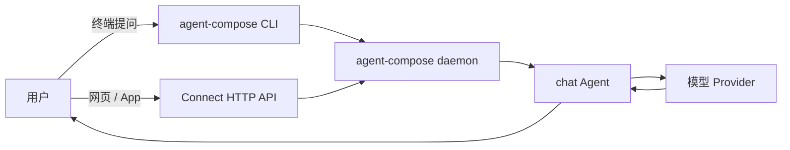

# Agent 不只会埋头干活，也可以坐到前台聊天

> 栏目：01 · 对话机器人

很多人第一次用 agent-compose，是让 Agent 在后台跑一项自动化任务：给它一句话，等它交作业。可当产品经理问“能不能把它接进聊天窗口，让用户随时来问？”时，事情并没有突然变成另一门学问。`chat-agent` 就是那座最短的桥。

想象一下：新同事阿布每天都在群里回答“这个平台能做什么”“入口在哪”“为什么我的任务没跑”。他回答到第三十七遍时，眼神已经像一台进入省电模式的显示器。我们需要的不是再加一份定时任务，而是一位能被 CLI、网页或业务服务随时叫到的对话助手。

## 把“一次任务”换成“一次会话”

自动化任务和对话机器人的核心其实相同：提示进入 Agent，模型返回结果。变化的是入口和交互节奏。



这个例子刻意保持“小而诚实”：只有一个 Agent，没有工具、工作区和持久状态。它不会偷偷查系统，也不会假装见过你的业务数据。它最适合先验证三件事：请求能进来、模型能回答、现有服务能通过 API 接入。

## 一份配置，两个前台窗口

配置中最重要的是 `chat` 这个 Agent。`system_prompt` 像员工入职手册，规定它友好、可靠、跟随用户语言，也明确禁止编造事实和泄露环境信息。示例不固定模型，具体模型由 daemon 的 provider 配置决定。

先让它在终端接待一位访客：

```bash
cd agents/chat-agent
agent-compose config --quiet
agent-compose up
agent-compose run -it chat --prompt "你好，请用三句话介绍 agent-compose"
```

终端对话跑通后，网页或业务服务不必复制一套 Agent。它们可以调用 daemon 的 Connect RPC HTTP API：

```bash
export AGENT_COMPOSE_HOST=http://127.0.0.1:7410
export PROJECT_ID='<从 up --json 或 inspect 中取得的 project-id>'

curl -sS "$AGENT_COMPOSE_HOST/agentcompose.v2.RunService/RunAgent" \
  -H 'Content-Type: application/json' \
  -d "{\"projectId\":\"$PROJECT_ID\",\"agentName\":\"chat\",\"prompt\":\"今天你能帮我做什么？\"}"
```

这就是这个样例最值得偷走的设计：**渠道负责收发消息，Agent 负责如何回答**。今天入口是 CLI，明天换成客服台、内部 Portal 或 App，Agent 的角色规则仍是同一份。

## 什么时候该从它继续长大

| 需求 | 下一步 |
| --- | --- |
| 只想验证模型与 daemon 连通 | 原样使用这个最小例子 |
| 网页里需要异步等待结果 | 使用同一服务的 `StartAgentRun` |
| 要记住多轮上下文 | 在接入层保存会话并明确状态边界 |
| 要查知识库或调用业务系统 | 为 Agent 增加经过授权的工具，并处理不可信输入 |
| 要定时主动找人 | 看 `scheduled-agent`，那是另一种触发方式 |

一个好用的聊天机器人，不是“会说话的 cron”。它首先是一条稳定的请求通道，然后才逐步增加记忆、知识和工具。`chat-agent` 把第一步压缩到一份配置和两条调用路径，正适合从“Agent 只会后台打工”的惯性里迈出来。

想看每个字段和清理命令，请回到 [chat-agent README](../../agents/chat-agent/README.md)。实验结束后运行 `agent-compose down`。
