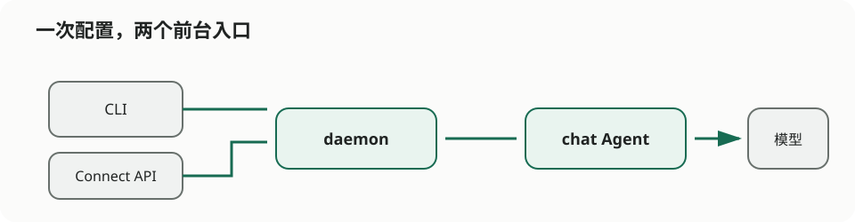

# 阿布终于不用第 38 次回答“入口在哪”

> 栏目：01 · 对话机器人

周一上午九点零三分，阿布在群里收到一句：“请问报销入口在哪？”

九点零七分，同一句又来了一次。十点二十四分，第三次。到下午四点，这个问题已经换了七种礼貌程度，在三个群里出现了十二次。

阿布不是不愿意帮忙。他只是开始怀疑：自己入职时的岗位名称，到底是“产品运营”，还是“人形搜索框”。



## 于是，前台多了一位不怕重复问题的同事

我们给这位新同事取了一个很朴素的名字：`chat`。

它不懂读心术，也不会半夜偷偷翻公司资料。它只做一件事：有人从终端问，它回答；有人从网页或 App 问，它还是回答。入口可以换，背后的“接待员”不用换。

这正是 `agents/chat-agent` 想展示的事。很多人用 agent-compose，是给 Agent 派一张任务单，然后等它交作业。对话机器人只是把任务单变成了随时可以递进来的问题：

> 用户开口 → daemon 接住 → `chat` 按自己的岗位守则回答 → 结果回到用户面前。

终端是员工通道，Connect HTTP API 是给网页和业务系统留的门。两扇门后面，坐着同一位接待员。

## 它的“员工手册”只有四条

示例里的 `system_prompt` 没有写成一本厚重的规章制度，只告诉它：友好、可靠；不知道就说明假设；跟随提问者的语言；不要假装访问过外部系统。

这几句看起来平淡，却决定了机器人是诚实的接待员，还是一本正经的“消息灵通人士”。一个不能查考勤的机器人，不该用播音腔宣布：“您昨天迟到了三分钟。”能力边界，比口气像不像真人更重要。

## 让它先接待一位访客

```bash
cd agents/chat-agent
agent-compose config --quiet
agent-compose up
agent-compose run -it chat --prompt "你好，新同事第一天该从哪里开始？"
```

这条链路跑通后，现有网页或服务可以通过 daemon 的 Connect API 找到同一个 `chat`。换句话说，先不用急着设计头像、气泡颜色和“正在输入……”动画；先证明问题能进来、回答能出去，而且它不会把不知道的事情讲得像亲眼见过。

## 后来，阿布怎么样了？

机器人接走了那些重复、明确、随时会来的问题。阿布则开始处理真正需要人判断的例外：制度没覆盖的新情况、两边都觉得自己有道理的争议，以及“能不能今天就上线”这种机器人也应该假装没听见的问题。

当机器人需要记住多轮对话，可以在接入层增加会话；需要查知识库，可以给它经过授权的工具；需要主动在九点提醒大家，则该去看 scheduled-agent。`chat-agent` 没有把未来一次做完，它只是把第一步做得非常短：**先给 Agent 一把前台钥匙，再决定要不要给它整栋楼。**

需要字段说明、API 请求样例和清理命令时，请看严谨版的 [chat-agent README](../../agents/chat-agent/README.md)。
