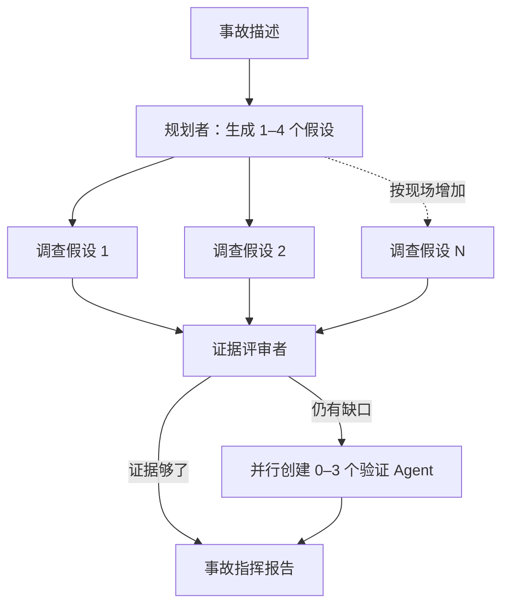

# 事故还没发生，谁知道要派几个 Agent？

> 栏目：02 · 动态工作流

凌晨两点，告警说“订单服务变慢”。有人怀疑数据库，有人盯上下游，还有人坚定地认为“八成是缓存”。如果在部署时就画死三条调查分支，真实事故很快会用第四种可能教育我们：世界不肯配合流程图。

`dynamic-workflow` 展示的是另一种做法：先让规划者根据现场描述列出假设，再按数组动态创建调查 Agent；证据不足时，评审者还能临时追加第二轮验证。工作流不是预先摆满椅子，而是来了几位专家，就搬几把椅子。

> **实验性提示：** 此例依赖 agent-compose 尚未合并的 dynamic workflow 上游 PR。稳定版即使通过静态配置校验，也可能因 guest SDK 缺少 `workflowFile()` 等 API 而无法运行。请让 daemon、CLI、guest 与 runtime SDK 使用包含该 PR 的同一版本。

## 执行图是“跑”出来的



一次运行实际调用的 Agent 数是 `3 + N + M`：三个固定角色是规划者、证据评审者和报告者；`N` 是现场产生的假设数，`M` 是评审后追加的验证数。两个数字都来自前序 Agent 的结构化输出，而不是 YAML 里预留的“专家一号到专家七号”。

## 模型做判断，JavaScript 管秩序

这套机制不是让模型自由发挥到天边。工作流把职责分得很清楚：

- 模型负责理解事故、提出假设、比较证据和撰写报告；
- JSON Schema 把假设限定为 1–4 个、补充验证限定为 0–3 个，并约束领域和状态枚举；
- JavaScript 用 `pipeline()`、`parallel()` 和条件分支展开执行图；
- `phase()` 汇报阶段进度，稳定的 invocation key 配合 resume cache 复用已完成调用；
- 并发数被限制为 3，整次运行也有明确超时。

这是一条很实用的分界线：**语义判断交给 Agent，数量、边界、并发和恢复交给程序。**

## 亲手制造一次“不确定”

在包含实验特性的环境中运行：

```bash
cd agents/dynamic-workflow
agent-compose config --quiet
agent-compose up
agent-compose scheduler invoke incident_workflow --payload '{
  "incident": "订单服务发布后延迟升高，数据库锁等待与下游超时同时增加",
  "secondWave": "auto"
}'
```

`secondWave` 有三档：`auto` 让评审者判断，`force` 强制演示二次验证，`skip` 则直接跳过。输出会告诉你实际 Agent 数、每个 invocation 的状态、假设和补充验证数量，以及最终中文报告。

如果某次长调查中断，不必让已经交卷的专家集体重考。把输出里的 `runId` 作为 `resumeRunId` 再次提交，runtime 会按稳定 key 尝试复用已完成调用。

## 动态，不等于随意

固定工作流像套餐，动态工作流像点菜。只有当“吃几道、请哪类专家”必须看运行时数据才知道时，后者才真正划算，例如：

| 场景 | 动态展开依据 |
| --- | --- |
| 事故调查 | 实际故障域与证据缺口 |
| 代码审查 | 变更涉及的语言、模块和风险 |
| 数据分片 | 运行时发现的数据集与分区 |
| 专家会诊 | 规划结果选择的专业角色 |

如果步骤数量部署时已经确定，普通 scheduler 脚本或事件链往往更简单。动态机制的价值不是让流程图看起来更炫，而是避免为了未知数量的工作预留空槽、手传关联 ID、自己聚合结果和恢复状态。

完整文件说明、恢复命令和清理方式见 [dynamic-workflow README](../../agents/dynamic-workflow/README.md)。这个例子只给出诊断与安全操作建议，不访问生产环境，也不声称修复已经发生。
