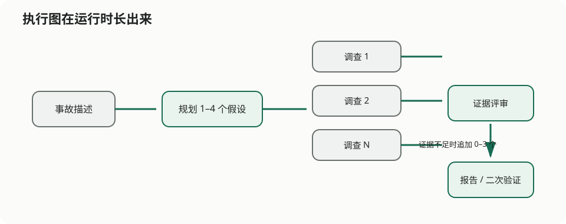

# 凌晨两点的事故群，最不缺的就是“我觉得”

> 栏目：02 · 动态工作流

凌晨两点十七分，订单服务突然变慢。

老周说：“数据库，一定是数据库。”小林说：“刚发过版，先看应用。”隔壁组探出半个脑袋：“有没有可能是下游？”十分钟后，事故群里已经坐满了观点，只差证据。

更麻烦的是，你事先根本不知道该找几个人。小事故可能一个方向就够，大事故会同时牵出数据库、应用、基础设施和依赖。如果提前安排八位专家排排坐，大多数夜晚会有五个人陪着空气值班；如果只安排两位，第三个问题总会准时出现。



## 先看现场，再组队

`dynamic-workflow` 不在部署时把队伍人数写死。它先请“规划者”看事故描述，列出 1–4 个值得调查的假设。现场有几个方向，就临时叫来几个调查 Agent。

第一轮回来后，还有一位证据评审者负责问一句很扫兴但很重要的话：“这些结论，证据够吗？”

- 够了，就请事故指挥者整理报告；
- 不够或互相打架，就再叫 0–3 位验证 Agent，专门补证据缺口；
- 最终报告会明确区分已知事实、推测和下一步建议。

所以一次运行会有多少 Agent，不是配置作者拍脑袋决定的，而是现场一步步长出来的。dynamic workflow 已经合入 agent-compose 新版本；只要 daemon、CLI、guest 和 runtime SDK 使用相互兼容的近期版本，这种“边走边组队”就是正式能力。

## 自由发挥？不，这支队伍有门禁

故事听起来像临时拉群，底下的纪律却很程序员。

模型负责理解“发生了什么”；JavaScript 负责“最多叫几个人、谁先谁后、能否并行、失败多久算超时”。每位 Agent 的回答还要过 JSON Schema：假设最多四个，二次验证最多三个，状态只能从规定选项中选择。

这就像让专家负责诊断，让场务负责名单、座位和散场时间。不能反过来——让专家一边分析数据库，一边随心情决定再叫四十个人。

## 来一次不确定的演习

```bash
cd agents/dynamic-workflow
agent-compose config --quiet
agent-compose up
agent-compose scheduler invoke incident_workflow --payload '{
  "incident": "订单服务发布后延迟升高，数据库锁等待与下游超时同时增加",
  "secondWave": "auto"
}'
```

`auto` 会让证据评审者决定是否追加第二轮。想看完整剧情，可以用 `force`；想让大家准点下班，可以用 `skip`。输出里会列出真正叫来了多少 Agent、每个人做到了哪一步，以及最终报告。

如果演习半路断了，拿上一次的 `runId` 作为 `resumeRunId` 再来。稳定的 invocation key 和 resume cache 会尽量复用已经完成的工作，不让交过卷的人因为路由器打了个喷嚏就重新考试。

## 它不只适合事故群

“先看清任务，再决定队伍”是一种很普世的模式：一批代码改了几种语言，就找几类审查者；一份材料涉及哪些领域，就请哪些专家；数据来了多少分片，就展开多少处理分支。

但如果步骤早就确定，普通脚本或事件链更省心。动态工作流不是更豪华的流程图，它解决的是一个具体问题：**直到事情发生，我们才知道事情有多大。**

想研究 Schema、恢复参数、并发限制和完整调用链，请看 [dynamic-workflow README](../../agents/dynamic-workflow/README.md)。
