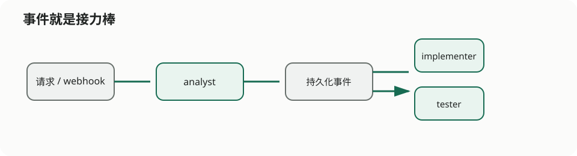

# Three People, No Meeting, and a Surprisingly Clear Handoff

> Column: 03 · Event-driven workflow

The analyst posts a long message. The implementer returns from lunch to eighty replies. The tester asks, “What are we actually changing?” A meeting is scheduled to reconstruct the previous meeting.



`event-driven-workflow` replaces that meeting with three independent Agents and durable handoff parcels: `analyst` produces an analysis event, `implementer` produces an implementation-design event, and `tester` produces a prioritized test plan.

Each event carries the request, the previous result, and a `correlationId`. People do not have to be online together, and a failed stage can be retried without restarting every earlier stage.

```bash
cd agents/event-driven-workflow
agent-compose config --quiet
agent-compose up
agent-compose scheduler trigger analyst analyze-change --payload '{
  "correlationId": "demo-001",
  "title": "Add rate limiting to the login endpoint",
  "description": "Keep existing clients compatible and return a recognizable error"
}'
```

This sample has no repository or test environment mounted, so it gives suggestions and never claims to have changed code or run tests. Events are parcels, not proof that every sentence inside the parcel is trustworthy.

Use the chain when stages need separate ownership, retries, permissions, or consumers. For a short task that always succeeds or fails as one unit, a single Agent is simpler.

See the [event-driven-workflow README](../../agents/event-driven-workflow/README.en.md) for topics and scheduler details.
