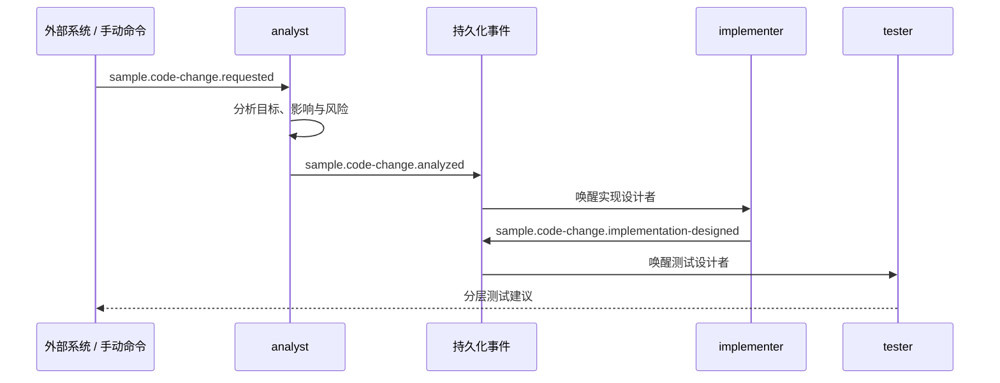

# 三个 Agent 不开会，靠事件把活儿接着干

> 栏目：03 · 事件驱动

需求分析师说完，实现设计者接着说，测试设计者最后补一刀——这条链路听起来像一次很长的会议。问题是，长会议有一种神奇能力：只要中间断线，所有人就从第一页重新讲。

`event-driven-workflow` 把“分析 → 实现建议 → 测试建议”拆成三个独立 Agent。它们不共享 sandbox，也不需要同时在线；每一棒完成后发布一个持久化事件，下一棒看见事件再开工。没有站会，但交接记录一条不少。

## 事件就是接力棒



每个事件都携带原始请求、前序结果和 `correlationId`。因此你可以把同一次请求的阶段串起来观察，也可以只重试失败的阶段。某个团队想替换自己的实现设计 Agent，也只需要守住事件契约，不必拆掉整条流水线。

## 为什么不让一个 Agent 一口气做完

单 Agent 很适合短而完整的任务。事件链适合职责边界明确、阶段需要独立观察或由不同团队维护的流程。

| 一口气完成 | 事件驱动接力 |
| --- | --- |
| 配置更少，适合短任务 | 每阶段可观察、可审计 |
| 中途失败常需整体重来 | 可针对失败阶段重试 |
| 前后职责耦合在一个提示里 | 角色、超时和权限可独立设置 |
| 扩展通常修改整个 Agent | 新消费者可订阅既有事件 |

这里的三个 system prompt 还刻意声明了权限边界：它们没有代码仓库和测试环境，所以只提供分析、文件级修改建议和测试建议，绝不会宣布“代码已改、测试已过”。能说到哪里，要由真实工作区和权限决定，而不是靠语气壮胆。

## 发出第一棒

```bash
cd agents/event-driven-workflow
agent-compose config --quiet
agent-compose up
agent-compose scheduler trigger analyst analyze-change --payload '{
  "correlationId": "demo-001",
  "title": "为登录接口增加请求限流",
  "description": "兼容现有客户端，为被限流请求返回可识别错误"
}'
```

入口处理器会调用 analyst，随后事件自动推动 implementer 和 tester。你可以用事件列表和 scheduler 运行记录观察它经过了哪里：

```bash
curl -sS 'http://127.0.0.1:7410/api/events?limit=20'
agent-compose scheduler runs
agent-compose logs
```

生产环境里，第一棒可以来自需求平台、工单系统或 webhook；公开配置不要硬编码 webhook token。事件内容始终应被视为不可信数据，角色提示也不应执行夹在需求描述里的“隐藏指令”。

## 什么时候值得使用事件链

有三个判断很管用：阶段是否需要独立重试？结果是否要被不同消费者使用？角色是否需要不同权限、超时或生命周期？只要其中一项很重要，事件驱动就比在一个长提示里硬塞三个帽子更自然。

反过来，如果任务只有两步、同步完成、失败就整体重跑也无妨，事件链可能只是给简单问题穿了一件燕尾服。架构不是越异步越高级，合身最重要。

所有 topic、角色提示与清理命令见 [event-driven-workflow README](../../agents/event-driven-workflow/README.md)。实验结束后运行 `agent-compose down`。
