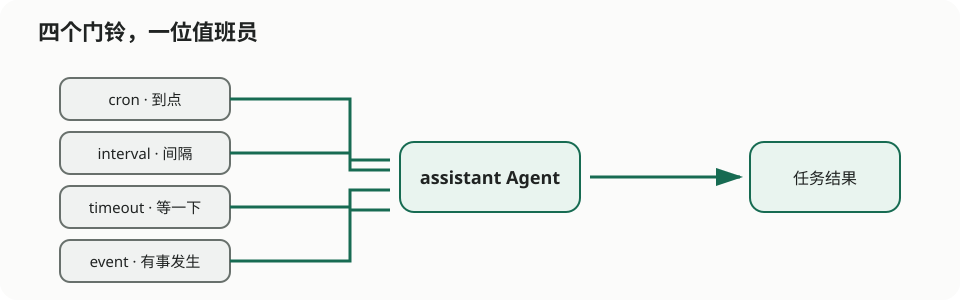

# One On-Call Engineer, Four Alarms, One Badge

> Column: 04 · Multiple triggers

Jamie is asked to check service health on the hour, every hour, thirty seconds after startup, and whenever a business event arrives. Jamie brings four alarms to work. At 9:00 they all ring during a test, proving the service is healthy and the on-call engineer is not.



`scheduled-agent` keeps one `assistant` Agent and gives it four reasons to wake up:

- `cron` follows the calendar;
- `interval` follows elapsed time;
- `timeout` waits once after startup;
- `event` reacts when something happens elsewhere.

```bash
cd agents/scheduled-agent
agent-compose config --quiet
agent-compose up
agent-compose scheduler ls assistant
agent-compose scheduler trigger assistant hourly-status
agent-compose scheduler trigger assistant external-event --payload '{"source":"manual-demo"}'
```

Cron uses the daemon’s timezone. When “9 a.m.” happens at 8 a.m., the Agent is usually innocent; the deployment timezone is not.

Declarative triggers are ideal when each alarm directly invokes one Agent. Use `scheduler.script` for state, routing, retries, or multiple calls. Use dynamic workflow when even the number of branches is unknown until runtime.

The [scheduled-agent README](../../agents/scheduled-agent/README.en.md) has the exact trigger fields and cleanup commands.
