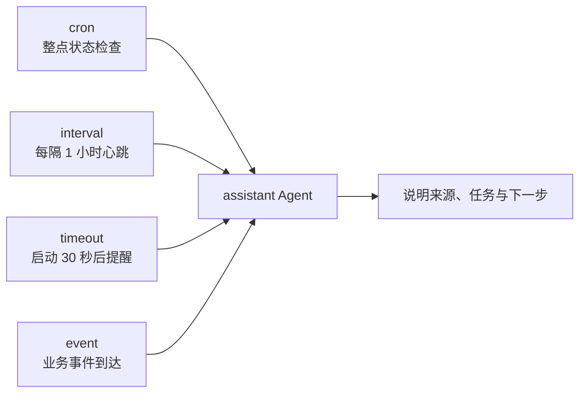
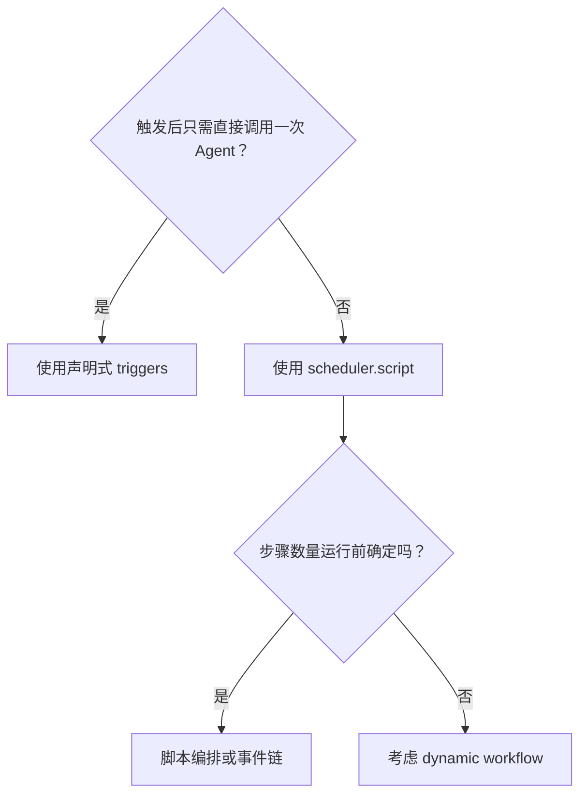

# Agent 的闹钟不止一种：到点、隔一会、等一下、出事了

> 栏目：04 · 多种触发方式

“每天九点提醒我”是定时；“每隔一小时看一次”也是定时；“服务启动三十秒后检查”似乎还是定时；“订单失败时马上处理”——等等，这回根本没看钟。

`scheduled-agent` 想讲清楚一件常被名字耽误的事：scheduler 不只是 cron。agent-compose 的声明式 trigger 可以用 cron、interval、timeout 和 event 四条路径唤醒同一个 Agent。处理逻辑不用复制四份，铃声可以有四种。

## 四个门铃，一位值班员



四种 trigger 的差别不在“谁更高级”，而在它们如何回答“为什么现在执行”：

| 触发器 | 它回答的问题 | 典型场景 |
| --- | --- | --- |
| `cron` | 日历和时钟到了吗？ | 工作日报、每周汇总、整点巡检 |
| `interval` | 距离上次间隔够了吗？ | 心跳、周期提醒、轮询式检查 |
| `timeout` | 启动后等够一次了吗？ | 延迟初始化、一次性启动复查 |
| `event` | 某件业务事情发生了吗？ | webhook、订单状态、告警通知 |

cron 使用 daemon 所在环境的时区。“我明明写了九点，它为什么八点上班”通常不是 Agent 有早到美德，而是部署时区没确认。

## 声明铃声，不重复招聘

`agent-compose.yml` 里只有一个 `assistant`。四个 trigger 各自提供不同 prompt，所以回答会标明触发来源，但真正执行的仍是同一个 Agent。这对“逻辑相同、时间或来源不同”的任务尤其合适。

```bash
cd agents/scheduled-agent
agent-compose config --quiet
agent-compose up
agent-compose scheduler ls assistant
```

`startup-reminder` 会在 scheduler 启动约 30 秒后自动执行一次。开发时没必要端着咖啡等整点，可以手动敲响每个铃：

```bash
agent-compose scheduler trigger assistant hourly-status
agent-compose scheduler trigger assistant recurring-heartbeat
agent-compose scheduler trigger assistant startup-reminder
agent-compose scheduler trigger assistant external-event \
  --payload '{"source":"manual-demo"}'
```

生产系统也可以向 `sample.scheduled-agent.run` topic 发布事件，event trigger 会自动启动同一个 Agent。Webhook source 如何创建和认证取决于 daemon 的部署方式，凭据应由环境配置提供，别把 token 当纪念品提交进仓库。

## 声明式 trigger 什么时候不够用

四种 trigger 适合“到条件就发这段 prompt”。当需求开始出现条件路由、保存状态、多 Agent 接力、复杂重试或一次触发里多次调用模型时，就应使用 `scheduler.script`。同一个 Agent 上不能同时配置 `scheduler.triggers` 和 `scheduler.script`，选型可以简单记成：



所以 scheduled-agent 并不是四个自动化样例塞在一起，而是一张触发方式地图：**处理者可以稳定不变，启动它的理由可以来自时间、生命周期或业务世界。**

完整 trigger 配置、观察日志和清理步骤见 [scheduled-agent README](../../agents/scheduled-agent/README.md)。运行历史可用 `agent-compose scheduler runs assistant` 查看，最后以 `agent-compose down` 收工。
